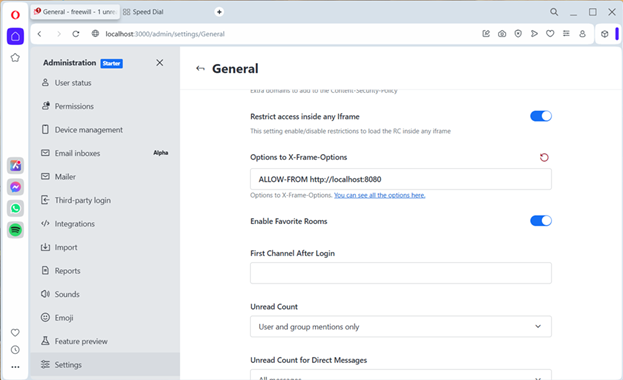
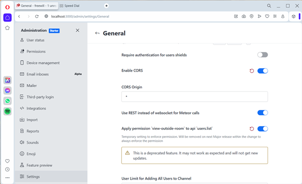
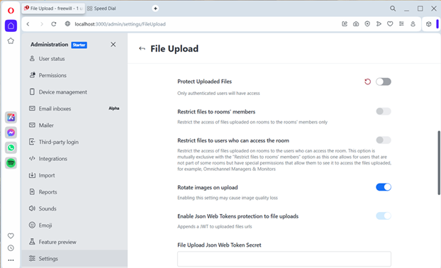

## Rocket Chat

This is project introduce to work with rocket chat

## Installation

With rocket chat (comes with [installation](https://www.rocket.chat/install))

## Setup
Since this project required mongodb as database setup before starting 
you can unzip or extract `mongodb_data.zip` into working directory.

## Configuration
After install & run finished, try to login as administrator and setting up the following. 

1. General -> Options to X-Frame-Options try to allow web application server url \
ex. ALLOW-FROM http://localhost:8080

2. General -> REST API
	- tick Allow Getting Everything
	- tick Enable CORS
	- CORS Origin -> *
	

	
3. File Upload
	- tick File Upload Enabled
	- untick Protect Uploaded Files
	

## Restriction
If you want to integrate with web application try to password as same as username when register

